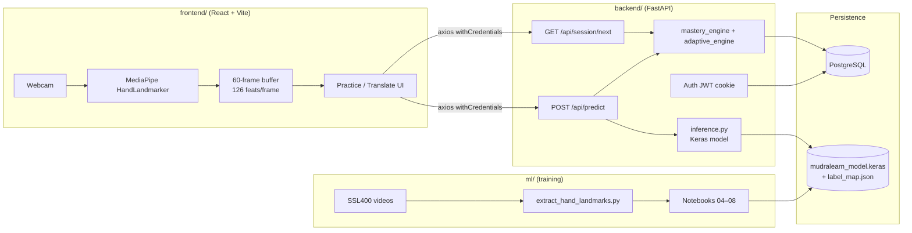

# MudraLearn — Project Documentation

Engineering documentation generated from the repository state on branch `dev` (2026-08-09). Claims cite concrete paths; where the code or docs are ambiguous or contradictory, that is stated explicitly.

---

## Table of Contents

1. [Project Overview](#1-project-overview)
2. [Architecture](#2-architecture)
3. [Repository Structure](#3-repository-structure)
4. [Backend (FastAPI)](#4-backend-fastapi)
5. [Frontend (React + TypeScript + Vite)](#5-frontend-react--typescript--vite)
6. [ML Pipeline](#6-ml-pipeline)
7. [Environment & Setup](#7-environment--setup)
8. [Development Workflow](#8-development-workflow)
9. [Known Issues / TODOs](#9-known-issues--todos)
10. [Next Steps](#10-next-steps)

---

## 1. Project Overview

**MudraLearn** is an adaptive Sri Lankan Sign Language (ISL/SSL) learning web application. Learners sign into a webcam; MediaPipe extracts hand landmarks in the browser; a Keras sequence model on the FastAPI backend classifies the gesture; practice sessions use mastery scoring and an adaptive curriculum.

| Layer | Stack | Location |
|-------|--------|----------|
| Frontend | React 19, TypeScript, Vite 8, Tailwind CSS 3, TanStack Query, Axios, Framer Motion, `@mediapipe/tasks-vision` | `frontend/` |
| Backend | FastAPI, SQLAlchemy 2, Alembic, PostgreSQL, JWT (HttpOnly cookie), TensorFlow/Keras inference | `backend/` |
| ML | Jupyter notebooks, MediaPipe HandLandmarker extraction, BiGRU + MultiHeadAttention (and V1 LSTM/GRU/CNN baselines) | `ml/` |

**Current project status (factual, from repo):**

- Full-stack app on `dev` with auth, practice, translate, dictionary, and dashboard routes wired (`frontend/src/main.tsx`, `backend/app/main.py`).
- Production inference path loads `ml/saved_models/mudralearn_model.keras` + `label_map.json` (**204** classes in the checked-in label map on disk).
- V2/V3 hand-landmark training artifacts exist under `ml/saved_models/v2/` and `v3/` (gitignored); latest remediation numbers (312 classes, gate **FAIL**) are documented in `All MD files/GROUND_TRUTH.md` on branch `fix/ml-pipeline-remediation`, which is **not** merged into `dev`.
- Google OAuth is a **501 stub** (`backend/app/routers/auth.py`); `backend/app/services/llm_service.py` is empty; Redis is listed as a prerequisite in `README.md` but not used by application code under `backend/app/`.

---

## 2. Architecture

### 2.1 Component interaction

```
┌─────────────┐     HTTPS / cookies      ┌──────────────────┐
│  React SPA  │ ◄──────────────────────► │  FastAPI backend │
│  Vite :5173 │   axios +Credentials     │  uvicorn :8000   │
└──────┬──────┘                          └────────┬─────────┘
       │                                          │
       │ MediaPipe HandLandmarker                 ├── PostgreSQL (users, OTP,
       │ (browser WASM)                           │   progress, mastery)
       │ 60 × 126 features                        │
       │                                          └── Keras model
       ▼                                              (load at startup)
  Webcam frames                              ml/saved_models/*.keras
```

ML training is offline: videos under `ml/data/` → scripts/notebooks → `ml/saved_models/`. The backend only **loads** a trained artifact at startup (`backend/app/main.py` → `inference.load_model()`).

### 2.2 Runtime data flow (practice / translate)

1. User grants camera access (`PracticePage.tsx`, `TranslatePage.tsx`).
2. `useHandLandmarker` (`frontend/src/hooks/useHandLandmarker.ts`) runs MediaPipe `HandLandmarker` in VIDEO mode.
3. Per frame: 21 landmarks × 3 coords × 2 hands → wrist-relative + palm-scale normalisation → **126** floats (must match `ml/scripts/extract_hand_landmarks.py`).
4. Buffer **60** frames (`SEQUENCE_LEN`), then `POST /api/predict` via `frontend/src/services/api.ts`.
5. Backend validates shape, runs `inference.predict`, scores correctness (top sign == `target_sign` and confidence ≥ 0.60), writes `Progress`, updates `MasteryScore` EWMA (`backend/app/routers/predict.py`, `mastery_engine.py`).
6. Practice mode also calls `GET /api/session/next` (adaptive engine reading `frontend/public/signs_data.json` + mastery rows).

### 2.3 Mermaid diagram



Architecture drawings also exist (untracked at doc generation time) under `docs/architecture/`.

---

## 3. Repository Structure

```
MudraLearn/
├── README.md                 # Setup, model metrics, high-level architecture
├── Daily Workflow.md         # Local startup commands (paths may be stale)
├── GIT_AUDIT_2026-07-22.md   # Git hygiene audit (local; *.md mostly gitignored)
├── PROJECT_DOCUMENTATION.md  # This file
├── All MD files/             # Local audit/plan docs (not the primary source of truth for code)
├── docs/architecture/        # System / UML diagrams (HTML + PNG)
├── .venv/                    # Shared Python env used by README / Daily Workflow
├── frontend/                 # React SPA
├── backend/                  # FastAPI API
└── ml/                       # Training pipeline + artifacts
```

### 3.1 `frontend/` (annotated)

```
frontend/
├── package.json              # Scripts: dev, build, lint, preview
├── vite.config.ts            # @vitejs/plugin-react only (no API proxy)
├── tailwind.config.js        # Pixel / neo-brutalist design tokens
├── index.html                # SPA shell → /src/main.tsx
├── public/
│   └── signs_data.json       # Sign catalogue (total 383); used by dictionary + adaptive engine
└── src/
    ├── main.tsx              # Actual app entry: providers + routes
    ├── App.tsx               # Legacy home — NOT mounted by main.tsx
    ├── contexts/AuthContext.tsx
    ├── services/
    │   ├── api.ts            # App API client (predict, session, dashboard)
    │   ├── auth.ts           # Auth API client
    │   └── dashboardData.ts  # Mock gamification helpers for dashboard
    ├── hooks/
    │   ├── useHandLandmarker.ts   # Active CV path (HandLandmarker)
    │   ├── useMediaPipe.ts        # Legacy PoseLandmarker path
    │   ├── useDashboardSummary.ts
    │   └── useDashboardSigns.ts
    ├── pages/                # Route-level screens (see §5)
    └── components/           # landing, auth, dashboard, about, blog, ui
```

### 3.2 `backend/` (annotated)

```
backend/
├── .env.example              # Env template (no secrets)
├── requirements.txt          # Pinned API + TF deps
├── alembic.ini
├── alembic/versions/
│   ├── 0001_password_auth.py
│   └── 0002_dashboard.py
└── app/
    ├── main.py               # FastAPI app, CORS, middleware, router mounts
    ├── database.py           # Engine, SessionLocal, get_db
    ├── rate_limit.py         # slowapi Limiter
    ├── models/
    │   ├── user.py           # User, EmailOTP, AuthSession (+ Base)
    │   └── progress.py       # Progress, MasteryScore
    ├── routers/
    │   ├── auth.py
    │   ├── predict.py
    │   ├── session.py
    │   ├── progress.py
    │   └── dashboard.py
    └── services/
        ├── inference.py
        ├── mastery_engine.py
        ├── adaptive_engine.py
        ├── dashboard_service.py
        └── llm_service.py    # Empty placeholder
```

### 3.3 `ml/` (annotated)

```
ml/
├── requirements.txt          # Full pinned Jupyter/TF stack
├── requirements_v2.txt       # Slimmer stack + opencv + mediapipe (README setup)
├── DATASET_LABEL_AUDIT.md    # Local label-count audit
├── ML_AUDIT_2026-07-20.md    # Local forensic audit
├── data/                     # gitignored — SSL400 videos, CSVs, .npy
├── logs/                     # Extraction logs (gitignored)
├── notebooks/
│   ├── 01_data_exploration.ipynb … 08_evaluation.ipynb
│   └── ml/saved_models/      # Accidental nested V1 weights (tracked)
├── scripts/
│   ├── extract_hand_landmarks.py
│   ├── augment_sequences.py
│   ├── generate_signs_data.py
│   └── hand_landmarker.task
└── saved_models/             # gitignored — keras weights, label maps, reports
```

---

## 4. Backend (FastAPI)

Entry: `backend/app/main.py` — title `MudraLearn API`, SlowAPI rate limiting, unhandled-exception middleware, CORS for `http://localhost:5173` / `127.0.0.1:5173` with credentials, startup loads ML model only (schema via Alembic, not `create_all()`).

### 4.1 API endpoints

| Method | Path | Auth | Purpose | Request | Response (shape) |
|--------|------|------|---------|---------|------------------|
| GET | `/` | No | Health | — | `{status: "MudraLearn API running"}` |
| POST | `/api/auth/check-email` | No | Is email registered? | `{email}` | `{registered: bool}` |
| POST | `/api/auth/email/request-otp` | No | Send/create signup OTP | `{email}` | `{message, expires_in_minutes}` (+ `dev_otp` if `ENV != production`) |
| POST | `/api/auth/email/verify-otp` | No | Verify OTP → signup token | `{email, otp}` | `{signup_token, email, expires_in_minutes}` |
| POST | `/api/auth/complete-signup` | No (token) | Create user + login | `{signup_token, password, first_name, last_name, username}` | `{user, access_token}` + HttpOnly cookie |
| POST | `/api/auth/login` | No | Password login | `{email, password}` | `{user, access_token}` + cookie |
| GET | `/api/auth/username-available?u=` | No | Username availability | query `u` | `{available, error}` |
| POST | `/api/auth/onboarding/username` | Yes | Set username | `{username}` | `{user}` |
| POST | `/api/auth/google/callback` | No | Google OAuth | `{id_token}` | **501** stub |
| POST | `/api/auth/logout` | No | Clear cookies | — | `{message}` |
| GET | `/api/auth/me` | Yes | Current user | — | `{user}` |
| POST | `/api/predict` | Yes | Sign classification | `{sequence: 60×126, target_sign, category, response_ms?}` | `{top_sign, confidence, correct, feedback, top3[], mastery}` |
| GET | `/api/session/next` | Yes | Next practice sign | — | `{sign, category, mode, mastery}` |
| GET | `/api/session/mastery` | Yes | Mastery table | — | `{user_id, signs[], total}` |
| GET | `/api/progress/history?limit=` | Yes | Attempt history | `limit` 1–200 (default 50) | `{user_id, attempts[]}` |
| GET | `/api/dashboard/summary` | Yes | Dashboard aggregates | — | camelCase summary (stats, masteryOverall, tierBreakdown, needsReview, recentActivity, hasProgress) |
| GET | `/api/dashboard/signs` | Yes | Paginated sign mastery | `search`, `category`, `page`, `page_size` | `{signs[], page, pageSize, total, totalPages}` |

Sources: `backend/app/routers/*.py`, `backend/app/main.py`.

Auth resolution (`get_current_user` in `auth.py`): HttpOnly cookie `access_token`, else `Authorization: Bearer …`.

### 4.2 Database schema

ORM: `backend/app/models/user.py`, `backend/app/models/progress.py`. No SQLAlchemy `relationship()` declarations — FKs only.

| Table | Model | Key columns | Relationships (logical) |
|-------|--------|-------------|-------------------------|
| `users` | `User` | `id` UUID PK, `email` unique, names, `username`, `role`, `auth_provider`, `google_id`, `email_verified_at`, `password_hash`, `signup_step`, lockout fields, timestamps | Parent of sessions / progress / mastery |
| `email_otps` | `EmailOTP` | `email`, `otp_hash`, `expires_at`, `attempts` | Standalone OTP store |
| `auth_sessions` | `AuthSession` | `user_id` FK nullable, `email`, `token_hash`, `purpose`, `consumed`, `expires_at` | Temp signup tokens (`signup_temp`) |
| `progress` | `Progress` | `user_id` FK, `sign_id`, `category`, `confidence`, `correct`, `response_ms`, `timestamp` | Append-only attempt log |
| `mastery_scores` | `MasteryScore` | `user_id` FK, `sign_id`, `score`, `attempts`, `last_seen`, `tier_unlocked` | One row per (user, sign) |

**Alembic** (`backend/alembic/versions/`):

| Revision | Effect |
|----------|--------|
| `0001_password_auth` | Add password/lockout/signup columns on `users`; allow nullable `user_id` + `email` on `auth_sessions` |
| `0002_dashboard` | Add `users.role`; index `ix_progress_user_sign_timestamp` |

Base table creation is **not** fully covered by these migrations (they alter assuming tables already exist from historical `create_all` / prior setup). `database.create_tables()` exists but is **not** called on startup.

### 4.3 Environment variables

From `backend/.env.example` and code usage:

| Variable | Required | Purpose | Notes |
|----------|----------|---------|-------|
| `DATABASE_URL` | Yes | PostgreSQL SQLAlchemy URL | `database.py`, `alembic/env.py` — no default |
| `SECRET_KEY` | Yes | JWT + signup token pepper | `os.environ['SECRET_KEY']` in `auth.py` |
| `OTP_PEPPER` | Yes | OTP hash pepper | Raises if missing |
| `ACCESS_TOKEN_EXPIRE_MINUTES` | No | JWT/cookie TTL | Default **240** |
| `ALGORITHM` | — | Documented as `HS256` | **Unused** — code hardcodes `HS256` |
| `GEMINI_API_KEY` | — | Intended LLM key | **Unused** — `llm_service.py` empty |
| `MODEL_PATH` | No | Keras model path | Default `ml/saved_models/mudralearn_model.keras` |
| `LABEL_MAP_PATH` | No | Label map JSON | Default `ml/saved_models/label_map.json` |
| `ENV` | No | `production` vs development | Controls secure cookies, `dev_otp`, error detail leakage |

---

## 5. Frontend (React + TypeScript + Vite)

### 5.1 Entry and routing

- **Entry:** `frontend/src/main.tsx` (not `App.tsx`).
- **Providers:** `QueryClientProvider` → `BrowserRouter` → `AuthProvider`.
- **Protected routes:** `/practice`, `/dashboard` via `ProtectedRoute.tsx`.

| Path | Page | Notes |
|------|------|-------|
| `/` | `LandingPage` | Marketing composition |
| `/about`, `/blog` | About / Blog | Static content sections |
| `/translate` | `TranslatePage` | Webcam free translation — **not** behind `ProtectedRoute`, but predict API requires auth |
| `/practice` | `PracticePage` | Adaptive practice + capture |
| `/dictionary` | `DictionaryPage` | Loads `/signs_data.json` |
| `/splash` | `SplashPage` | Loading transition |
| `/signin`, `/login`, `/verify-email` | Auth | Email → OTP or password |
| `/onboarding/*` | Onboarding wizard | Router `location.state` carries signup payload |
| `/welcome` | `WelcomePage` | Auto-redirect to dashboard |
| `/dashboard` | `DashboardPage` | Live API + mock gamification mix |

### 5.2 Key components / hooks

| Area | Path | Responsibility |
|------|------|----------------|
| Hand CV | `hooks/useHandLandmarker.ts` | MediaPipe HandLandmarker, normalize, buffer 60 frames, call `predictSign` |
| Legacy CV | `hooks/useMediaPipe.ts`, `components/WebcamCapture.tsx` | Pose path — **orphaned** (not imported by routes) |
| Auth UI | `components/auth/*` | Pixel/neo-brutalist chrome |
| Dashboard | `components/dashboard/*` | Sidebar, mastery table, streak, etc. |
| Landing | `components/landing/*` | Hero, HowItWorks, CTA, Footer |

### 5.3 State management

| Mechanism | Usage |
|-----------|--------|
| React Context | `AuthContext` — session user, signup/login/logout |
| TanStack React Query | Dashboard summary + signs only |
| Local state | Forms, webcam, practice/translate, dictionary filters |
| Router state | Onboarding wizard fields |
| Zustand | Listed in `package.json` — **not imported** under `frontend/src` |

### 5.4 Backend communication

- `frontend/src/services/api.ts` — `baseURL: 'http://localhost:8000/api'`, `withCredentials: true`, 401 → `/signin`.
- `frontend/src/services/auth.ts` — `baseURL: 'http://localhost:8000/api/auth'`, separate instance (no 401 redirect loop on `getMe`).
- No `VITE_*` env vars; API host is hardcoded.
- Session is HttpOnly cookie–based; frontend does not attach Bearer tokens from memory.

Helpers `getMastery` and `getProgressHistory` are defined in `api.ts` but unused by pages as of this scan.

---

## 6. ML Pipeline

### 6.1 Dataset

| Item | Value | Source |
|------|--------|--------|
| Name | **SSL400** — Sri Lankan Sign Language video dataset | `ml/scripts/extract_hand_landmarks.py`, `README.md`, about UI |
| Publisher (UI copy) | IIT Colombo researchers since 2022 | `frontend/src/components/about/OurJourney.tsx` |
| On-disk scale (current working tree) | ~4,236 videos / Hand-CSVs; 383 sign folders | Audits + `signs_data.json` total |
| Trainable classes (v3 remediation) | **312** after `MIN_SAMPLES_PER_CLASS=3` (71 excluded) | `All MD files/GROUND_TRUTH.md` |
| Production label map on disk | **204** entries | `ml/saved_models/label_map.json` |
| README figures | 2,477 videos / 204 classes / 63.31% Top-1 | `README.md` — **stale relative to GROUND_TRUTH v3** |

**License / attribution:** Project documentation requirement — treat SSL400 as **CC BY-NC-SA 4.0** and retain attribution for any redistribution or derived models. A formal license file or SPDX declaration for the dataset was **not found** in this repository; UI text describes the dataset as “freely available” without naming that license. Confirm upstream license terms before public release.

Data lives under `ml/data/` (gitignored):

- `archive/Dataset - Original/` — raw videos  
- `archive/Dataset - Hand - CSV/` — HandLandmarker CSVs `(60, 126)`  
- `archive/Dataset - MP - CSV/` / `MP - VID/` — V1 pose pipeline  
- `hand_v2/`, `hand_v3/` — processed `.npy` arrays  

### 6.2 Preprocessing

**V1 pose** (`ml/notebooks/01_data_exploration.ipynb`): MP-CSV → 30 frames × 132 features → LabelEncoder → min–max normalize → train/val/test.

**V2/V3 hand** (`ml/scripts/extract_hand_landmarks.py` + notebooks `04`–`05`):

1. MediaPipe HandLandmarker on original videos  
2. Wrist-relative centering; palm-scale via landmark 9  
3. Left(63) + right(63) = 126 features/frame  
4. Linear interpolate to 60 frames  
5. Stratified splits (`04_hand_data_prep.ipynb`)  
6. Augmentation (`augment_sequences.py`): noise, temporal stretch, spatial jitter, hand mirror  

**Caveat on `dev` HEAD:** `extract_hand_landmarks.py` still uses a case-sensitive `*.mp4` glob; case-insensitive `.mp4`/`.mov` handling and tiered augmentation for `hand_v3` live on unmerged `fix/ml-pipeline-remediation`.

### 6.3 Model architecture

Models **are defined** in notebooks (not missing).

| Generation | Definition | Architecture summary |
|------------|------------|----------------------|
| V1 | `02_lstm_train.ipynb`, `03_compare_models.ipynb` | LSTM / GRU / Conv1D stacks; week3 chose GRU (~33% Top-1) → historical `mudralearn_model.keras` |
| V2/V3 candidate | `06_bigru_attention_train.ipynb` | `Input(60,126)` → BiGRU(128)+BN+Dropout → BiGRU(64)+BN → MultiHeadAttention(4, key_dim=32)+residual → Dense → softmax |
| Ensemble | `07_ensemble.ipynb` | BiGRU + GRU + CNN average |

Backend inference (`backend/app/services/inference.py`) loads whatever path `MODEL_PATH` points to; comment in code still mentions `(204,)` output shape.

### 6.4 Stage of `ml/week1-preprocessing`

| Fact | Detail |
|------|--------|
| Branch tip | `30d065d` — data exploration notebook + requirements |
| Contents at tip | `ml/notebooks/` (effectively `01_data_exploration.ipynb`) + `ml/requirements.txt` only |
| Relation to `dev` | Merged into history (week1 → week2 LSTM → week3 compare → hand-landmark rebuild). Week1 work is **complete and superseded** |
| What week1 delivered | Pose-CSV exploration, sequence build, normalize, split, save arrays / label map |
| What already exists beyond week1 on `dev` | Notebooks `02`–`08`, extraction/augmentation scripts, BiGRU+Attention training path |

Week1 itself has no remaining open tasks. Outstanding ML product work is remediation merge, gate criteria, and production model promotion (see §10).

---

## 7. Environment & Setup

### 7.1 Prerequisites

- Python 3.10+  
- Node.js 18+  
- PostgreSQL 16  
- Redis (listed in `README.md` / `Daily Workflow.md`; **not referenced** by current `backend/app` code)

### 7.2 Python virtual environments

Documented setup (`README.md`):

```bash
python -m venv .venv
source .venv/bin/activate
pip install -r ml/requirements_v2.txt
pip install -r backend/requirements.txt
```

| Path | Status |
|------|--------|
| Repo-root `.venv/` | Present; used by README and `Daily Workflow.md` |
| `ml/.venv/` | Also present on disk (secondary env) |
| `ml/venv/` | **Missing** — but Jupyter kernel `mudralearn-ml` still points here |
| `backend/venv/` | **Missing** (older docs may have used it) |

Prefer a single shared env (root `.venv`) unless you intentionally isolate ML tooling.

### 7.3 Jupyter kernel `mudralearn-ml`

Registered at `~/Library/Jupyter/kernels/mudralearn-ml/kernel.json` with:

```text
.../MudraLearn/ml/venv/bin/python
```

That interpreter path does not exist. Re-register against the env you actually use, e.g.:

```bash
source .venv/bin/activate   # or ml/.venv
python -m ipykernel install --user --name mudralearn-ml --display-name "MudraLearn ML"
```

### 7.4 PostgreSQL

```bash
brew services start postgresql@16
# create DB/user as needed, then:
cp backend/.env.example backend/.env
# set DATABASE_URL, SECRET_KEY, OTP_PEPPER
cd backend && alembic upgrade head
```

Ensure base tables exist (migrations alone may not create the full schema from an empty database — use `create_tables()` once if bootstrapping a fresh DB, or restore from an existing schema). Exact bootstrap path is **unclear from current code** beyond the Alembic alter migrations.

### 7.5 Run locally

```bash
# Background (once/day)
brew services start postgresql@16 && brew services start redis

# Backend
cd backend && source ../.venv/bin/activate
uvicorn app.main:app --reload
# http://localhost:8000

# Frontend
cd frontend && npm install && npm run dev
# http://localhost:5173

# ML notebooks
cd ml && source ../.venv/bin/activate
jupyter notebook
```

### 7.6 Setup gotchas (observed)

| Issue | Evidence | Notes |
|-------|----------|-------|
| Dual / stray venvs | Root `.venv` + `ml/.venv`; kernel → missing `ml/venv` | Wrong interpreter → import / TF mismatches |
| Stale Daily Workflow paths | `Daily Workflow.md` uses `Coding folder/.../mudralearn` | Update to current workspace path |
| Case-sensitive video glob | `extract_hand_landmarks.py` on `dev` | Drops `.MOV`/`.mov`/`.MP4`; fixed on remediation branch only |
| Nested `ml/notebooks/ml/saved_models/` | Tracked accidental V1 weights | Wrong CWD when saving from notebooks |
| Production model vs v3 candidate | `MODEL_PATH` → root `mudralearn_model.keras` (204-class era); v3 candidate not promoted | See GROUND_TRUTH §5–6 |
| `*.md` gitignored | `.gitignore` | Most markdown audits are local-only; `PROJECT_DOCUMENTATION.md` is allowlisted |
| `uvicorn --reload-exclude` | — | **Not present** in current repo docs or scripts; no resolved gotcha to cite |

---

## 8. Development Workflow

### 8.1 Branching and tags

**Observed pattern** (from `git branch` / PR merges / tags — not a formal written policy in `Daily Workflow.md`):

```
main  ←  stable / release line
  ↑
dev   ←  integration (current working branch for this doc)
  ↑
feature/*, feat/*, fix/*, ml/week*, backend/*  ←  topic branches via PRs
```

Examples present: `feature/frontend-ui`, `feature/user-dashboard`, `feat/adaptive-engine`, `ml/week1-preprocessing`, `ml/week2-lstm`, `ml/week3-compare-models`, `fix/ml-pipeline-remediation`, `staging`.

**Tags:**

| Tag | Meaning (message / README) |
|-----|----------------------------|
| `v1.0-pre-accuracy` | Pre–accuracy-fix build; model ~33% (README still says `v1.0-baseline` — **name mismatch**) |
| `v2.0-hand-landmarks` | HandLandmarker era |

### 8.2 Local run checklist

1. Start PostgreSQL (and Redis if you rely on it for other tooling).  
2. Activate `.venv`, ensure `backend/.env` is filled.  
3. Terminal A: `uvicorn app.main:app --reload` from `backend/`.  
4. Terminal B: `npm run dev` from `frontend/`.  
5. Optional Terminal C: Jupyter from `ml/`.  
6. Feature work: branch from `dev`, open PR back to `dev`, then promote to `main` when ready.

---

## 9. Known Issues / TODOs

### 9.1 Inline `TODO` / `FIXME`

Scanned `backend/**/*.py`, `frontend/src/**/*.{ts,tsx}`, `ml/scripts/**/*.py`: **no `TODO` or `FIXME` comments**.

Open work appears in stubs, audits, and dead code instead.

### 9.2 Incomplete / stubbed functionality (by area)

**Backend (`backend/`)**

| Item | Location |
|------|----------|
| Google OAuth returns 501 | `app/routers/auth.py` |
| Empty LLM service | `app/services/llm_service.py` |
| `GEMINI_API_KEY` / `ALGORITHM` unused | `.env.example` vs code |
| Redis / fastapi-cache2 unused | `requirements.txt` vs `app/` |
| Alembic does not create full base schema | `alembic/versions/*` |

**Frontend (`frontend/`)**

| Item | Location |
|------|----------|
| Google sign-in UI stubbed | `SignInPage.tsx` |
| `App.tsx` unused | Not imported by `main.tsx` |
| Pose `WebcamCapture` / `useMediaPipe` orphaned | No route imports |
| Zustand unused dependency | `package.json` |
| `getMastery` / `getProgressHistory` unused | `services/api.ts` |
| Translate page unprotected but predict requires auth | `main.tsx` vs `predict.py` |
| Dashboard mixes live API + mock XP/gamification | `DashboardPage.tsx`, `dashboardData.ts` |
| Hardcoded API base URL | `services/api.ts`, `auth.ts` |

**ML (`ml/`)**

| Item | Location / branch |
|------|-------------------|
| Evaluation gate FAIL (Top-5, F1 criteria) | `All MD files/GROUND_TRUTH.md`, `08_evaluation.ipynb` |
| Remediation not merged to `dev` | `fix/ml-pipeline-remediation` |
| `dev` extract glob still `*.mp4` only | `scripts/extract_hand_landmarks.py` |
| Stale production 204-class model vs 312-class v3 candidate | `MODEL_PATH` / `saved_models/` |
| Overfitting (train ~97% vs val ~63%) | GROUND_TRUTH §4 |
| Hierarchical models with no producer notebook | `saved_models/hierarchical/` |

---

## 10. Next Steps

Based on current branch `dev`, file state, and unmerged remediation work:

1. **Merge or cherry-pick `fix/ml-pipeline-remediation` into `dev`** — case-insensitive extraction, `hand_v3` paths, tiered augmentation, `generate_signs_data` source fix.
2. **Resolve production model promotion** — either retrain/pass gate for a 312-class candidate, or consciously keep the 204-class `mudralearn_model.keras` and align `signs_data.json` / UI claims; update `MODEL_PATH` / `LABEL_MAP_PATH` accordingly.
3. **Address evaluation gate failures** — Top-5 ≥ 85%, F1=0 class ratio, median F1 (see GROUND_TRUTH §6–8); consider `MIN_SAMPLES_PER_CLASS` tradeoff vs vocabulary size.
4. **Align dictionary / adaptive catalogue with model labels** — `signs_data.json` has 383 signs; production label map has 204; v3 trainable set is 312.
5. **Frontend auth consistency** — protect `/translate` or allow guest predict; remove or finish Google OAuth stub.
6. **Environment hygiene** — single venv story; re-point `mudralearn-ml` kernel; drop unused Redis deps or implement caching.
7. **Schema bootstrap docs** — document a reliable empty-DB path (Alembic baseline or one-shot `create_tables`).
8. **Housekeeping** — remove dead `App.tsx` / pose capture path, or mark as archived; decide fate of empty `llm_service.py`.

---

*Generated from repository inspection. Prefer code and Alembic/ORM definitions over README metrics when they disagree. Regenerate after major merges (especially ML remediation).*
